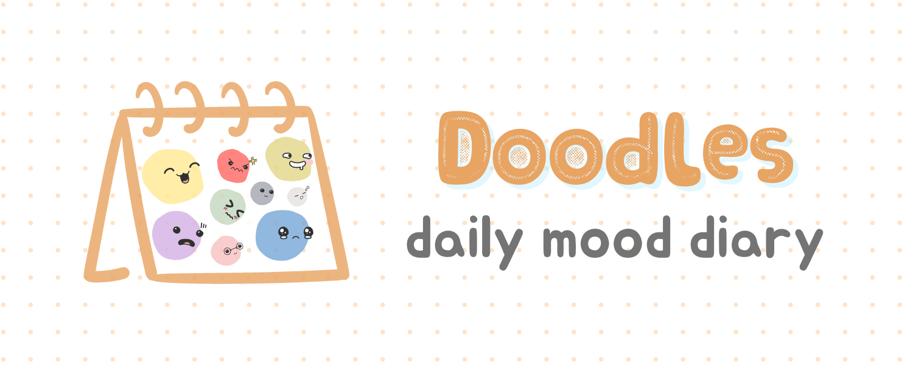
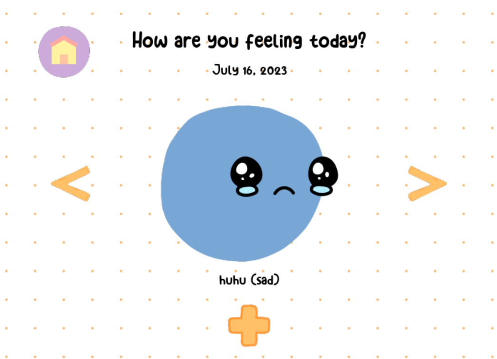

# doodle-mood-journal
Computer Programming II Final Project



Doodles is a Python program built with Pygame for tracking and recording daily moods. Users can log their emotions, add descriptions, and browse through past entries. The project features a relatively simple and cozy user interface meant to suit the playful theme of the application.

## Installation

To modify the source code:

1. Download and install the pygame module.

   - Install the `pygame` module, which is used for the GUI, by running the following command in the terminal:

     ```bash
     pip3 install pygame
     ```

2. Download all the files under this repository.

## In-App Screenshots:

   


